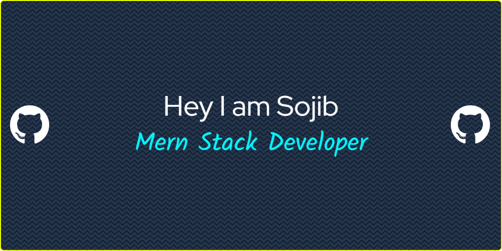

<div align="center">




<a href="https://git.io/typing-svg"></a>

</div>

---

<div align="center">

[](https://github.com/sojibahmedshorif25-ai)
[](https://www.linkedin.com/in/sojib-ahmed-shorif)
[](https://sojib-ahmed-developer.vercel.app)
[](mailto:sojibahmedshorif998@gmail.com)
[](mailto:sojibahmedshorif998@gmail.com)

</div>

---

### 🎯 About Me

```javascript
const sojib = {
  title: "Full Stack Developer",
  currentFocus: "Building scalable web applications",
  education: "Programming Hero Batch 13",
  location: "Rangpur, Bangladesh (Rowmari, Kurigram)",
  availableFor: ["Full-time", "Freelance", "Remote"],
  responseTime: "within 2 hours",
  askMeAbout: ["React", "Next.js", "Node.js", "MongoDB", "TypeScript"],
  funFact: "I love turning complex problems into simple, beautiful solutions"
};
```

### 🔥 What I Bring to the Table

<table>
<tr>
<td width="50%" valign="top">

#### 💻 **Technical Skills**

| Category | Technologies |
|----------|-------------|
| **Languages** | JavaScript (ES6+), TypeScript, HTML5, CSS3 |
| **Frontend** | React.js, Next.js, Tailwind CSS, Framer Motion |
| **Backend** | Node.js, Express.js, REST APIs, JWT, Firebase Auth, Google OAuth |
| **Database** | MongoDB, Mongoose, Cloudinary |
| **Payments & AI** | Stripe, Claude AI, Gemini API |
| **Tools** | Git, GitHub, VS Code, NPM, Vercel, Render, MongoDB Atlas |

</td>
<td width="50%" valign="top">

#### 🚀 **What I Do**

- 🎨 Build **pixel-perfect** responsive UIs
- ⚡ Create **lightning-fast** web applications
- 🤖 Integrate **AI features** (Claude, Gemini)
- 📱 Develop **mobile-first** experiences
- 🔐 Implement **secure** authentication systems
- 📊 Build **admin dashboards** with analytics

</td>
</tr>
</table>

<div align="center">

[](https://skillicons.dev)

</div>

> ### 💼 Open to Work — Full-time | Freelance | Remote
> 📧 **sojibahmedshorif998@gmail.com** · 📱 **+880 1942791004** ([WhatsApp](https://wa.me/8801942791004)) · ⏱️ Replies within 2 hours · 📄 [Download CV](https://sojib-ahmed-developer.vercel.app/resume.pdf) · 🌐 [Live Portfolio](https://sojib-ahmed-developer.vercel.app)

---

### 🏆 GitHub Trophies

<div align="center">

[](https://github.com/ryo-ma/github-profile-trophy)

</div>

---

### 📊 GitHub Statistics

<div align="center">


</div>

<div align="center">


</div>

---

### 🌟 Featured Projects

<table>
<tr>
<td width="50%" align="center">

**🚀 [Sojib-Ahmed-Portfolio](https://github.com/sojibahmedshorif25-ai/Sojib-Ahmed-Portfolio)**


> Premium portfolio with AI chatbot, GSAP animations, Three.js 3D effects, and admin dashboard

[](https://sojib-ahmed-developer.vercel.app)

</td>
<td width="50%" align="center">

**🎓 [SkillForge](https://github.com/sojibahmedshorif25-ai/JOB-STUDENT-TASK)**


> Full-stack learning platform with courses, quizzes, certificates, jobs, and interview prep

[](https://job-student-task.vercel.app)

</td>
</tr>
<tr>
<td width="50%" align="center">

**🏠 [InvestProp AI](https://github.com/sojibahmedshorif25-ai/Investprop-Ai)**


> AI-powered property investment platform with Claude integration and portfolio management

[](https://investprop-ai.vercel.app)

</td>
<td width="50%" align="center">

**🛒 [TypeMarket](https://github.com/sojibahmedshorif25-ai/TypeScript-Project)**


> Full-stack marketplace with admin dashboard, reviews, and role-based access

[](https://type-script-project-nine.vercel.app)

</td>
</tr>
<tr>
<td width="50%" align="center">

**💼 [Job Tracker](https://github.com/sojibahmedshorif25-ai/job-tracker)**


> MERN job portal with resume upload, applicant tracking, and Cloudinary integration

[](https://github.com/sojibahmedshorif25-ai/job-tracker)

</td>
<td width="50%" align="center">

**🚀 [StartupForge](https://github.com/sojibahmedshorif25-ai/startupforge)**


> Startup team builder with Google OAuth, better-auth sessions, and AI-powered features

[](https://github.com/sojibahmedshorif25-ai/startupforge)

</td>
</tr>
</table>

---

### 🛣️ My Journey

| Period | Milestone |
|--------|-----------|
| Jan 2026 – Aug 2026 | 🎓 **Complete Web Development** — Programming Hero Batch 13, 8-month intensive MERN program |
| Jan – Jun 2026 | 🧱 **Foundations → Full Stack** — HTML/CSS/JS → React → Node.js/Express → MongoDB, month by month |
| Jul – Aug 2026 | 🤖 **Auth & AI** — JWT, Firebase, Google OAuth, RBAC · Claude/Gemini AI chatbots & AI features |
| Now | 🚀 **Building production-ready apps** — 10+ projects shipped, open to Full-time / Freelance / Remote |

---

### 🧰 What I Can Build For You

| Service | Includes |
|---------|----------|
| 🌐 **Full-Stack Web Apps** | React + Node.js/Express + MongoDB, deployed on Vercel/Render — e.g. SkillForge, TypeMarket |
| 🔌 **REST APIs & Auth** | Secure JWT / Firebase / Google OAuth, role-based access, validation & error handling |
| 🤖 **AI Integration** | Claude/Gemini chat assistants, AI scoring & recommendations — e.g. InvestProp AI |
| 📊 **Dashboards & Workflows** | Admin panels, analytics, application tracking, file uploads via Cloudinary/Firebase |

---

### 💡 My Development Philosophy

<div align="center">

> *"Clean code, user-first design, and scalable architecture are not optional — they're the foundation of every project I build."*

</div>

---

### 🔥 Recent Activity

<div align="center">


</div>

---

### 📫 Let's Connect!

<div align="center">

[](mailto:sojibahmedshorif998@gmail.com)
[](https://www.linkedin.com/in/sojib-ahmed-shorif)
[](https://github.com/sojibahmedshorif25-ai)
[](https://sojib-ahmed-developer.vercel.app)
[](https://wa.me/8801942791004)

**📍 Rangpur, Bangladesh (Rowmari, Kurigram) · ⏱️ Replies within 2 hours**

</div>

---

<div align="center">


</div>
